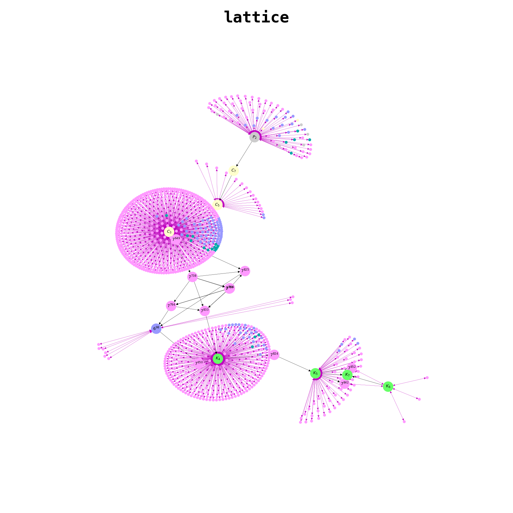

# about

This repository contains files related to the SH project called "Graph Homomorphisms".


# files

* graph_utils.py: simple graph utilities, such as generating, drawing etc

* homomorphism_solver.pyx: mediocre homomorphism solver (rewritten in Cython)

* plot_graph_families.py: generates pictures of some graph families. Exists here for the purposes of testing graph_utils

* solve_homomorphism.py: tries to find a homomorphism between two given graphs

* plot_homomorphism.py: generates an image of a given graph homomorphism

* profile_homomorphism.py: generates an overview of python profiling information on the solver

* setup.py: compile homomorphism solver into a shared library

  ---

* generate_small_graphs.py: a script to download Brendan McKay's dataset of graphs and write them into **small_graphs/** folder in a more convenient format (JSON). Uses **nauty** to decode g6 format of the original dataset

* graph_dataset_utils.py: a helper file for *generate_small_graphs.py*

* generate_connected_graph.py: a python program that generates a connected graph of given size and puts it into **graphs/** folder

  ---

* gap_test_solver: compares GAP solver's result with the solver

* gap_homomorphism_finder: uses GAP graph homomorphism finder to find a homomorphism between two graphs

* gap_homomorphism_core_finder: uses GAP and a dataset of small graphs to find a potential core by trying to find a homomorphism from a given graph

* gap_is_homomorphic_gh: uses GAP solver to print "YES" or "NO" if two graphs are homomorphic

* gap_test_lattice_relations: uses local solver to verify that some randomly chosen relations are correct, and might use GAP solver to provide diagnostics

* test_important_lattice_relations: fully verifies that all important nodes are connected correctly

  ---

* make_lattice.py: incrementally constructs a partial order graph out of given files, and produces an image

* lattice_utils.py: utilities for lattice operations

* make_lattice_animation.py: construct frames for an animation

* make_lattice_frame.py: construct individual image frame from a snapshot

* make_frames: construct image frames from snapshots in parallel

* make_movie: make a movie out of frames

* quick_notes.pdf: updated version of notes from papers

## solver

The current version of solver is relatively slow and can't handle large graphs. It is written to work iteratively, and chooses which options to iterate and how, and when to backtrack.


Some heuristics are being sought to improve its basic performance, such as connectedness to existing nodes, error heuristic and more.

## lattice

Below is a lattice image generated by putting in partial order graph of homomorphisms of all non-isomorphic connected graphs of size up to 7, and some more randomly generated bigger graphs:




# prerequisites

```bash
env python3 -m pip install -r --user requirements.txt
env python3 setup.py build_ext --inplace
# edit gap_config.sh and set GAP=/path/to/gap
```

For full functionality, you will also need:

* **nauty**
* **gap**
* **graphviz**
* **librsvg2-bin**
* **ffmpeg**

### usage

#### generating/downloading graphs

```bash
# download small graphs:
./generate_small_graphs.py
# generate some bigger graphs (15 being the size of the graph):
./generate_connected_graph.py 15
```

#### homomorphism solver

```bash
# use GAP to check if G -> H:
./gap_is_homomorphic_gh <gfile> <hfile>
# use python solver to check if G -> H:
time ./solve_homomorphism.py <gfile> <hfile>
# plot homomorphism G -> H (side by side):
./plot_homomorphism.py <gfile> <hfile>
# profile homomorphism solver G -> H:
./profile_homomorphism.py <gfile> <hfile>
# test the solver:
./gap_test_solver
```

#### lattice

```bash
# make lattice out of given graphs, by specifying graphs in the argument list, e.g.:
./make_lattice.py small_graphs/graph_{1,2,3,4,5}_*.json
# verify relations
./gap_test_lattice_relations
# verify the most important relations
./test_important_lattice_relations
```

##### animation

```bash
# generate lattice snapshots for each frame
./make_lattice_animation.py
# generate frames for the animation. should use multiple machines simultaneously, in the same FS:
./make_frames
cd frames
./make_movie
```

# resources

https://neerc.ifmo.ru/wiki/index.php?title=%D0%A2%D0%B5%D0%BE%D1%80%D0%B8%D1%8F_%D0%B3%D1%80%D0%B0%D1%84%D0%BE%D0%B2

http://www.lsi.upc.es/~valiente/abs-wsp-1997.pdf

http://www.math.tu-dresden.de/~bodirsky/Graph-Homomorphisms.pdf

https://en.wikipedia.org/wiki/Graph_homomorphism

https://www.info.ucl.ac.be/~yde/Papers/thesis-zampelli2008.pdf

https://link.springer.com/article/10.1023/A:1008647514949

https://ieeexplore.ieee.org/abstract/document/776131
